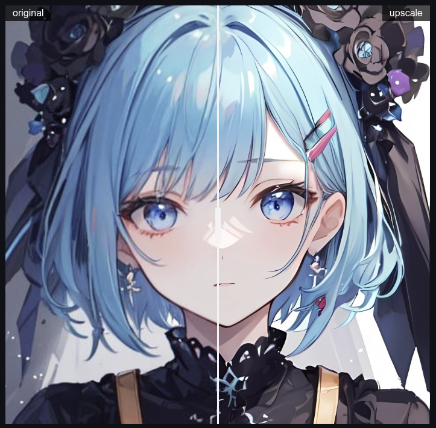

# Real-ESRGAN-TPU v2.0

Run [Real-ESRGAN](https://github.com/xinntao/Real-ESRGAN) on [Sophon](https://www.sophon.ai/) TPU

chip support: **SG2300X**, **BM1684X**

platform support: **ARM**, **X86** 
 
**✨Support run by gradio** ~~or streamlit~~ (do not maintain)

**🌟Support upscale video and image**

**🌠Support models:** *RealESRGAN_x4plus*, *RealESRGAN_x4plus_anime_6B*, *realesr-animevideo_v3*, *realesr-general-x4v3* 

**🏆Support Face Enhance:** *[CodeFormer](https://github.com/sczhou/CodeFormer)*, *[GFPGAN](https://github.com/TencentARC/GFPGAN)*

**🌟Support Background Remove:** *[RMBG](https://github.com/chenxwh/cog-RMBG)*

**🌠Support DIY Background Picture**

### Real-ESRGAN: Training Real-World Blind Super-Resolution with Pure Synthetic Data

> [[Paper](https://arxiv.org/abs/2107.10833)]   [[YouTube Video](https://www.youtube.com/watch?v=fxHWoDSSvSc)]   [[B站讲解](https://www.bilibili.com/video/BV1H34y1m7sS/)]   [[Poster](https://xinntao.github.io/projects/RealESRGAN_src/RealESRGAN_poster.pdf)]   [[PPT slides](https://docs.google.com/presentation/d/1QtW6Iy8rm8rGLsJ0Ldti6kP-7Qyzy6XL/edit?usp=sharing&ouid=109799856763657548160&rtpof=true&sd=true)]
> [Xintao Wang](https://xinntao.github.io/), Liangbin Xie, [Chao Dong](https://scholar.google.com.hk/citations?user=OSDCB0UAAAAJ), [Ying Shan](https://scholar.google.com/citations?user=4oXBp9UAAAAJ&hl=en)
> [Tencent ARC Lab](https://arc.tencent.com/en/ai-demos/imgRestore); Shenzhen Institutes of Advanced Technology, Chinese Academy of Sciences

[](https://github.com/xinntao/Real-ESRGAN/blob/master/assets/teaser.jpg)


## Usage

- Clone the repo

  ```bash
  git clone https://github.com/zifeng-radxa/Real-ESRGAN-tpu_Web.git
  ```
- Clone the tool-box
  ```bash
  cd Real-ESRGAN-tpu_Web
  git clone https://github.com/zifeng-radxa/FACEXLIB.git
  ```

- Setup environment
  ```bash
  pip3 install -r requirements.txt
  ## aarch64
  pip3 install https://github.com/radxa-edge/TPU-Edge-AI/releases/download/v0.1.0/tpu_perf-1.2.31-py3-none-manylinux2014_aarch64.whl
  ## x86
  pip3 install https://github.com/radxa-edge/TPU-Edge-AI/releases/download/v0.1.0/tpu_perf-1.2.31-py3-none-manylinux2014_x86_64.whl
  ```
- Instal FFmpeg (**do not support sophon-ffmpeg**)
  ```bash
  sudo apt install ffmpeg
  ```
- Download models
  ```bash
  python3 download_models.py
  ```
- Run the boot script
  - Run by gradio
  ```bash
  bash run_gr.sh
  ```
  ~~- *(Optional) Run by streamlit*~~
  ```bash
  bash run_st.sh
  ```

